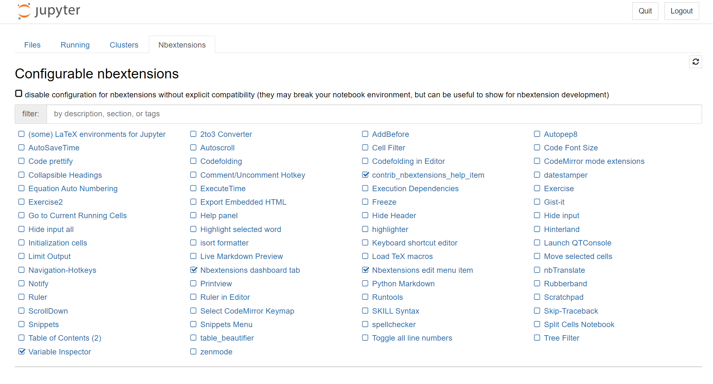

a Jupyter extension called "Jupyter Notebook Extensions" offers various functionalities, including cell styling options. 

A list of available plugins can be found her : https://jupyter-contrib-nbextensions.readthedocs.io/en/latest/index.html . Extensions enable you to change the layout of text blocks, for;at codeblocks, add table of contents etc.... You can install this notebook extension using the following commands:

```
conda install -c conda-forge jupyter_contrib_nbextensions

!jupyter contrib nbextension install --user
```


If the extension tab does not appear, you can try the following command


```
pip install jupyter_contrib_nbextensions "nbclassic<0.5"
```




Additional extensions can then be added manually in the setup folder (if you are unsure, look at the list of paths displayed in the console when typing `jupyter contrib nbextension install --user`). it should be

C:\Users\%USERPROFILE%\Anaconda3\share\jupyter\nbextensions

or

 C:\Users\%USERPROFILE%\AppData\Roaming\jupyter\nbextensions\

After this, the new extension will appear in the list (You may have to restart Jupyter after the setup). You have to enable the new extension by ticking the checkbox.

A custom extension enabling faster coloring, bold, italics etc... has been provided under the name text_formatter